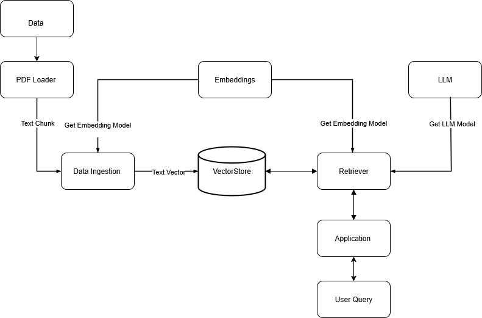

# End_End RAG Based Medical chatbot



* embeddings.py
    * Purpose:
        Loads a HuggingFace embedding model (sentence-transformers/all-MiniLM-L6-v2) for converting text into vector representations.
    * How it works:
        * The get_embeddings_model() function initializes and returns the embedding model, with logging and error handling.
* pdf_loader.py
    * Purpose:
Loads PDF files from a directory and splits them into manageable text chunks for further processing.
    * How it works:
        * load_pdf_files() uses LangChain’s DirectoryLoader and PyPDFLoader to read PDFs from DATA_PATH.
        * create_text_chunks(documents) splits documents into chunks using RecursiveCharacterTextSplitter, based on CHUNK_SIZE and CHUNK_OVERLAP.
* vector_store.py
    * Purpose:
Handles creation and loading of a FAISS vector store for efficient document retrieval.
    * How it works:
save_vector_store(text_chunks) embeds text chunks and saves them in a FAISS vector store at DB_FAISS_PATH.
load_vector_store() loads the vector store from disk if it exists, using the embedding model.
* llm.py
    * Purpose:
Loads Large Language Models (LLMs) from Groq or HuggingFace for answering questions.
    * How it works:
        * load_llm_GrOQ() loads a Groq LLaMA3 model using API keys.
        * load_llm_HF() loads a HuggingFace model using repo ID and token.
* retriever.py
    * Purpose:
Creates a retrieval-based QA chain using LangChain, combining LLMs and the vector store.
    * How it works:
        * Defines a custom prompt for concise medical answers.
        * create_qa_chain() loads the vector store and LLM, then creates a RetrievalQA chain that uses the retriever to fetch relevant context and answer questions.
* data_ingestion.py
    * Purpose:
Orchestrates the end-to-end process of loading PDFs, chunking text, and saving the vector store.
    * How it works:
        * process_and_store_pdfs() calls the PDF loader and chunker, then saves the chunks to the vector store.
        * Can be run as a script to build the vector store from scratch.

## How the System Works Together
**1. PDF Loading & Chunking:**
*pdf_loader.py* loads medical PDFs and splits them into chunks.

**2. Embedding:**
    *embeddings.py* provides the model to convert text chunks into vectors.

**3. Vector Store Creation:**
    *vector_store.py* saves these vectors in a FAISS store for fast retrieval.

**4. LLM Loading:**
    *llm.py* loads the language model (Groq or HuggingFace) for answering questions.

**5. QA Chain Construction:**
    *retriever.py* combines the LLM and vector store into a retrieval-augmented QA system, using a custom prompt for concise medical answers.

**6. Data Ingestion:**
    *data_ingestion.py* ties everything together, automating the process from PDF ingestion to vector store creation.

## Overall:
This pipeline enables a chatbot to answer medical questions by retrieving relevant information from ingested PDFs and generating concise answers using an LLM.


# How to run?
### STEPS:

Clone the repository

```bash
https://github.com/SunilKumar-ugra/End_2_End_Rag_Meddical_Chatbot.git
```
### STEP 01- Create a conda environment after opening the repository

```bash
conda create -n bbc-news python=3.8 -y
```

```bash
conda activate bbc-news
```
or 
```bash
uv venv .venv
```

### STEP 02- install the requirements
```bash
pip install -r requirements.txt
```
or 
```bash 
uv pip install -e .
```

```bash
# Finally run the following command
python app/application.py
```

Now,
```bash
http://127.0.0.1:80 #Open this url in the browser
```